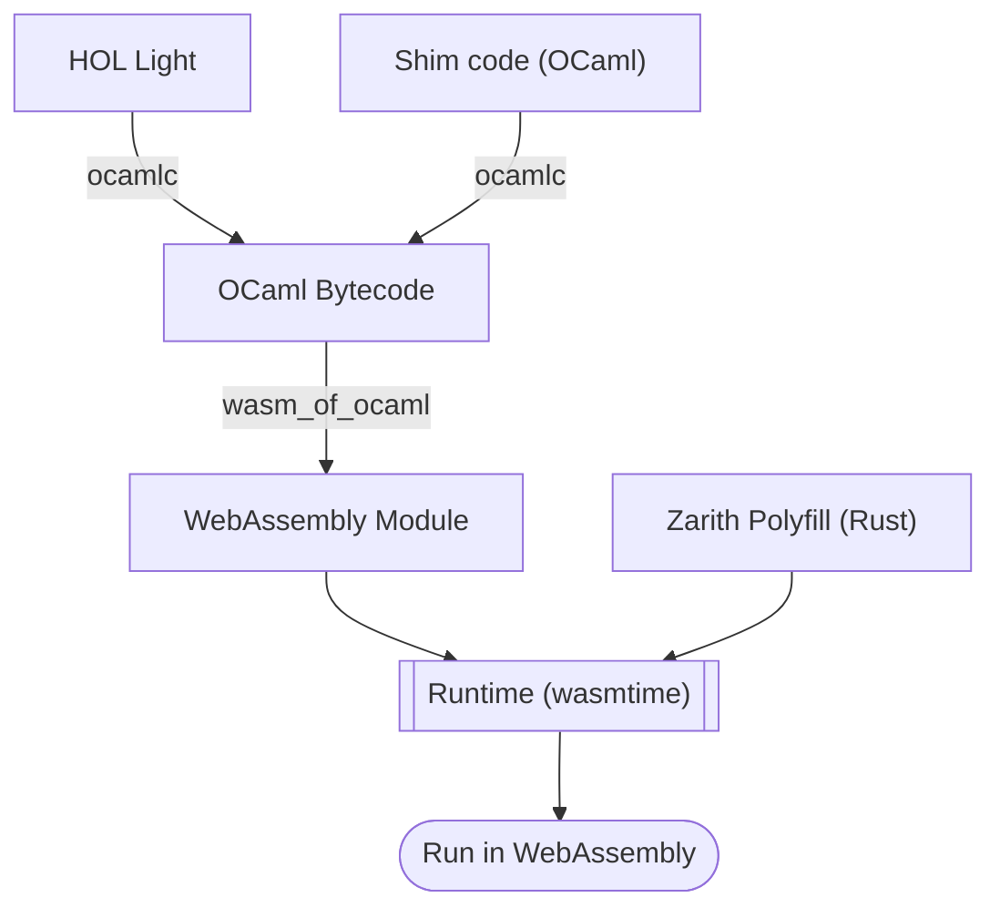

# HOL-Light-WASM

A proof of concept of compiling [HOL Light](https://github.com/jrh13/hol-light) to WebAssembly and running it in the [`wasmtime`](https://github.com/bytecodealliance/wasmtime) runtime.

> [!Warning]
>
> Due to some technical limitations, this project is currently unable to operate. Please refer to the [Limitations](#limitations) section below.

## How does it work?

The HOL Light theorem prover is written almost entirely in the OCaml programming language, with the Zarith library as its only native dependency.

Compiling OCaml code to WebAssembly involves two main steps:

1. Compile the OCaml source code to bytecode using the OCaml compiler `ocamlc`.
2. Compile the resulting bytecode to WebAssembly using the [`wasm_of_ocaml`](https://github.com/ocsigen/js_of_ocaml/blob/master/README_wasm_of_ocaml.md) toolchain.

Several other tools can also compile OCaml to WebAssembly, such as [`wasocaml`](https://github.com/OCamlPro/wasocaml) and [`wasicaml`](https://github.com/remixlabs/wasicaml/). Among these, I found `wasm_of_ocaml` to be the most practical choice for this project.

This project relies on an [unreleased version](https://github.com/ocsigen/js_of_ocaml/pull/1831) of `wasm_of_ocaml` that includes support for WASI and `exnref`. The main branch of `wasm_of_ocaml` currently targets only browser environments and cannot run under `wasmtime`, which I need because `wizer` is built on top of `wasmtime` (see the [Why do this?](#why-do-this) section below).

The runtime is implemented in Rust and performs two key tasks: setting up the WebAssembly environment (using `wasmtime`) and providing a polyfill for Zarith.

Last year, `wasmtime` added full support for the WasmGC proposal, which is required by `wasm_of_ocaml` because OCaml relies on garbage collection. In WebAssembly, any OCaml value can be represented as a GC reference (such as `anyref` or `eqref`), including function closures. This makes compiling OCaml to WebAssembly much more straightforward.

By inspecting the WebAssembly code generated by `wasm_of_ocaml`, I identified the required Zarith functions from the module's imports. I then implemented these functions in Rust using the [`rug`](https://crates.io/crates/rug) crate, referring to Jane Street's [JavaScript-based Zarith polyfill](https://github.com/janestreet/zarith_stubs_js) for interface details.

Overall, the workflow is as follows:

## Why do this?

Since HOL Light does not use theory files, every run involves proving all theorems from scratch, which is very time-consuming. To address this issue, the HOL Light readme recommends the use of checkpointing tools such as [`dmtcp`](https://github.com/dmtcp/dmtcp) to save and restore the state of the prover process. However, this approach has limitations: it is platform-dependent and not robust to changes in the underlying system.

WebAssembly runtime is a sandbox, making it possible to checkpoint WebAssembly programs in a platform-independent way. In fact, an existing project called [`wizer`](https://github.com/bytecodealliance/wizer) already implements this. It executes a pre-initialization function inside a WebAssembly module, then saves the memory contents and global variables into a new WebAssembly module. This new module can be loaded and run directly, with the state already set up as if the pre-initialization function had been executed.

Therefore, by compiling HOL Light to WebAssembly, we can use tools like `wizer` to capture the prover’s state after all theorems have been proved. This pre-initialized module can be loaded directly in future runs, which should be faster.

Alternative approaches to achieving similar outcomes include: modifying the HOL Light source code to support saving and loading states, hacking the OCaml runtime to enable checkpointing, or performing checkpointing at higher levels such as containers or virtual machines. The first two options require significant effort thus may not be practical, while the latter tends to incur higher overhead and complexity compared to the WebAssembly approach.

## Limitations

Currently, several issues are preventing this project from becoming functional:

- [Bugs](https://github.com/bytecodealliance/wasmtime/issues/11753) in the GC implementation of `wasmtime` cause HOL Light to hang during initialization. Disabling GC in `wasmtime` (by enabling the `gc-null` feature) allows the module to execute further, but it still fails because memory is quickly exhausted without GC.
- HOL Light’s special module system results in a very large initializer function (over 133k lines in WAT!), which may exceed the size limit for a single function in `cranelift` (the default backend of `wasmtime`) on certain platforms. I have tested this on arm64 macOS, x86_64 Linux, and arm64 Linux, and only x86_64 Linux works.
- Regarding the ultimate goal of checkpointing, `wizer` does not yet support WasmGC. I'm not sure whether this is a theoretical limitation or simply not yet implemented.

## I want to try it though...

Steps to build and run the project:

1. Clone the repository and git submodules.
2. Make sure you have the following tools installed:
   - OPAM
   - Rust and Cargo
   - The binaryen toolchain (for `wasm-opt`)
   - (Optional) `wasm-tools` (for inspect text format of Wasm binaries)
3. Run `make switch` to create a local OPAM switch with the certain versions of OCaml and `wasm_of_ocaml`.
4. Run `make hol-light` to build and install HOL Light to the OPAM switch.
5. Run `make main.wasm` to compile HOL Light to WebAssembly.
6. Enter the `runtime` directory and run `cargo run --release` to execute the WebAssembly module.
7. If you want to rebuild the WebAssembly module, run `make clean` first to remove previous build artifacts in case make does not detect changes correctly.

## License

This project is licensed under [GPL-3.0](LICENSE).
